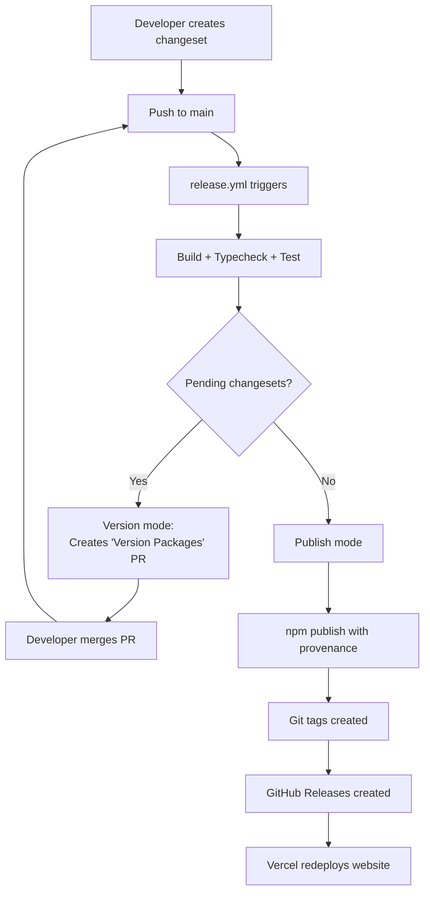

# Contributing to Directive

Everything you need to know about how the monorepo fits together &ndash; from local setup through production deployment.

---

## Architecture Overview

```
directive/
├── .changeset/              # Changesets config (versioning + npm publishing)
├── .claude/                 # Claude Code skills + project context
│   └── commands/            # 7 skills (/release, /changeset, /validate, etc.)
├── .github/workflows/
│   ├── ci.yml               # PR quality gate
│   └── release.yml          # npm publish on merge to main
├── e2e/                     # Playwright end-to-end tests
│   └── fixtures/            # Framework-specific test apps (React, Vue, etc.)
├── packages/
│   ├── core/                # @directive-run/core  (runtime engine)
│   ├── ai/                  # @directive-run/ai    (AI orchestration)
│   ├── react/               # @directive-run/react
│   ├── vue/                 # @directive-run/vue
│   ├── svelte/              # @directive-run/svelte
│   ├── solid/               # @directive-run/solid
│   ├── lit/                 # @directive-run/lit
│   └── vite-plugin-api-proxy/
└── docs/                    # Internal planning docs

> **Note:** The documentation website has been extracted to [directive-run/directive-docs](https://github.com/directive-run/directive-docs).
```

### Package Dependency Graph

```
@directive-run/core ─────────────────────────────┐
   │                                             │
   ├── @directive-run/react   (peer: core)       │
   ├── @directive-run/vue     (peer: core)       │
   ├── @directive-run/svelte  (peer: core)       │
   ├── @directive-run/solid   (peer: core)       │
   └── @directive-run/lit     (peer: core)       │
                                            m    │
@directive-run/ai ───────────────────────────────┘
   (peer: core)
```

### Tech Stack

| Tool | Version | Purpose |
|------|---------|---------|
| pnpm | 9.15+ | Package manager (workspaces) |
| TypeScript | 5.7+ | Language |
| tsup | &ndash; | Build: ESM + CJS + `.d.ts` + sourcemaps, target ES2022 |
| Vitest | 2.1+ | Unit + integration tests |
| Biome | 1.9+ | Lint + format (single tool) |
| Changesets | 2.29+ | Versioning + npm publishing |
| Playwright | 1.49+ | End-to-end framework tests |

---

## Package System

### Release Groups

Changesets uses **fixed groups** so packages in the same group always share the same version number:

| Group | Packages | Current Version |
|-------|----------|-----------------|
| Fixed | `core`, `react`, `vue`, `svelte`, `solid`, `lit`, `ai`, `cli`, `knowledge`, `devtools`, `claude-plugin` | 0.5.0 |
| Independent | `el` | 0.4.2 |

`el` versions independently because its core (`el()`, JSX, htm) has no dependency on `@directive-run/core`. Only the reactive bindings (`bind`, `bindText`, `mount`) require core.

`vite-plugin-api-proxy` is excluded from changesets.

### Subpath Exports

Packages expose multiple entry points via `exports` in `package.json`:

```
@directive-run/core          # Main runtime
@directive-run/core/plugins  # Built-in plugins (logging, devtools, persistence)
@directive-run/core/testing  # Test utilities (mock resolvers, assertion helpers)
@directive-run/core/migration # Codemods (Redux/Zustand/XState → Directive)

@directive-run/ai            # AI agent orchestration
@directive-run/ai/openai     # OpenAI adapter
@directive-run/ai/anthropic  # Anthropic adapter
@directive-run/ai/ollama     # Ollama adapter
@directive-run/ai/testing    # AI test utilities
```

### Build Output

Each package builds with tsup:
- **ESM** (`.js`) + **CJS** (`.cjs`) dual format
- **TypeScript declarations** (`.d.ts`)
- **Sourcemaps** enabled
- **Target:** ES2022
- **Tree-shakeable** (`sideEffects: false`)

Dependencies use `workspace:*` locally. When published, pnpm replaces these with the actual version numbers.

---

## Development Setup

### Prerequisites

- **Node.js 22+** (CI uses 22; engine requirement is >=18)
- **pnpm** (corepack or standalone install)

### Getting Started

```bash
git clone https://github.com/directive-run/directive.git
cd directive
pnpm install
pnpm -r build          # Build all packages (required before tests)
pnpm test              # Run all tests
```

### Environment Variables

| Variable | Required | Where | Purpose |
|----------|----------|-------|---------|
| `OPENAI_API_KEY` | Website build (embeddings) | Vercel env, local `.env` | Generates doc embeddings for AI chatbot |
| `ANTHROPIC_API_KEY` | AI adapter tests | Local `.env` | Running Anthropic adapter tests |
| `NPM_TOKEN` | Release workflow | GitHub secret | npm publishing (pre-configured) |
| `GITHUB_TOKEN` | Release workflow | GitHub secret (auto) | Changesets PR creation (auto-provided) |

### Common Commands

```bash
pnpm install              # Install all dependencies
pnpm -r build             # Build all packages
pnpm test                 # Run tests (Vitest, watch mode)
pnpm test -- --run        # Run tests once (no watch)
pnpm lint                 # Lint + format check (Biome)
pnpm lint:fix             # Auto-fix lint + format issues
pnpm typecheck            # TypeScript type checking (all packages)
pnpm dev                  # Watch mode (all packages)
pnpm clean                # Remove all dist/ and node_modules/
```

### Per-Package Commands

```bash
pnpm --filter @directive-run/core build
pnpm --filter @directive-run/core test
```

---

## Build Pipeline

### Package Builds

`pnpm -r build` runs tsup in each package. Build order follows the dependency graph automatically &ndash; core builds first, then framework adapters and AI.

### Docs Pipeline

> **Note:** The docs pipeline scripts (extract-api-docs, generate-embeddings) now live in [directive-docs](https://github.com/directive-run/directive-docs). The knowledge package's `generate-api-skeleton.ts` accepts a CLI path argument to locate `api-reference.json`.

The knowledge package still provides these steps:

| Step | Command | Reads | Writes |
|------|---------|-------|--------|
| Generate API Skeleton | `pnpm --filter @directive-run/knowledge generate [path-to-api-reference.json]` | `api-reference.json` | `packages/knowledge/api-skeleton.md` |
| Extract Examples | `pnpm --filter @directive-run/knowledge extract-examples` | `examples/*/src/*.ts` | `packages/knowledge/examples/*.ts` |
| Validate Knowledge | `pnpm --filter @directive-run/knowledge validate` | `api-skeleton.md`, `{core,ai}/*.md` | (validation only) |
| Build Skills | `pnpm --filter @directive-run/claude-plugin build` | `knowledge/{core,ai,examples}/*` | `claude-plugin/skills/` |

---

## CI/CD Pipeline

Two processes trigger on different events:

```
┌─────────────────────────────────────────────────┐
│                Push / PR to main                 │
├─────────────────────────────────────────────────┤
│                                                  │
│  PR opened/updated          Merge to main        │
│       │                          │               │
│       ▼                          ▼               │
│   ci.yml                    release.yml          │
│   ┌──────────┐              ┌──────────┐         │
│   │ test     │              │ typecheck│         │
│   │ lint     │              │ test     │         │
│   │ typecheck│              │ publish  │         │
│   └──────────┘              └──────────┘         │
│   Quality gate              npm release          │
│                                                  │
└─────────────────────────────────────────────────┘
```

> **Note:** Website deployment now happens from the [directive-docs](https://github.com/directive-run/directive-docs) repo via Vercel.

### PR to main &ndash; `ci.yml`

Runs on every pull request. **All checks must pass** before merge.

1. Checkout + pnpm setup (Node 22)
2. `pnpm install`
3. `pnpm -r build` &ndash; build all packages
4. `pnpm test -- --run` &ndash; run all tests
5. `pnpm lint` &ndash; Biome lint + format
6. `pnpm typecheck` &ndash; TypeScript across all packages

### Merge to main &ndash; `release.yml`

Runs on push to main when `packages/`, `.changeset/`, `release.yml`, or `pnpm-lock.yaml` change. Skips website-only and docs-only pushes.

1. Checkout + pnpm setup (Node 22)
2. `pnpm install`
3. `pnpm -r build`
4. `pnpm typecheck`
5. `pnpm test -- --run`
6. **Changesets action:**
   - If pending changesets exist → creates/updates a "Version Packages" PR
   - If no pending changesets (version PR was just merged) → publishes to npm with provenance, creates git tags, creates GitHub Releases

---

## Release Process

### Flow Diagram



### Step-by-Step

**1. Create a changeset**

```bash
pnpm changeset
```

Or use the `/changeset` skill in Claude Code. Select the affected packages and describe the change.

**Tips for fixed groups:**
- List one package from the group (e.g., `@directive-run/core`) &ndash; all group members bump automatically
- If an adapter (react, vue, etc.) has its own meaningful changes, list it explicitly for a proper changelog entry
- Packages with no changes of their own don't need listing &ndash; they get the version bump from the group

**2. Push to main**

The changeset file (`.changeset/*.md`) is committed with your code changes. CI runs on the PR. Merge when green.

**3. Version Packages PR (automatic)**

After merge, `release.yml` runs the Changesets action. It detects pending changesets and creates a "Version Packages" PR that:
- Bumps versions in all affected `package.json` files (fixed groups bump together)
- Updates `CHANGELOG.md` in each package
- Removes the consumed `.changeset/*.md` files

**4. Merge the Version PR**

Review the version bumps and changelogs, then merge.

**5. Publish (automatic)**

Merging triggers `release.yml` again. This time there are no pending changesets, so the Changesets action:
- Publishes to npm with provenance signing (`id-token: write` permission)
- Creates git tags (e.g., `@directive-run/core@0.2.0`)
- Creates GitHub Releases for each published package

### `pnpm changeset publish` vs `pnpm publish -r`

| Feature | `changeset publish` | `publish -r` |
|---------|---------------------|--------------|
| Creates git tags | Yes | No |
| GitHub Releases (via action) | Yes | No |
| Skips already-published versions | Yes | No (fails on conflict) |
| Reads `access` from config | Yes | Needs `--access public` |
| Provenance signing | Yes (with `id-token`) | Yes (with `id-token`) |

### Changeset Configuration

Key settings in `.changeset/config.json`:

| Setting | Value | Purpose |
|---------|-------|---------|
| `fixed` | `[["core", "react", "vue", ...]]` | Fixed groups &ndash; all bump together |
| `access` | `"public"` | Publish as public scoped packages |
| `baseBranch` | `"main"` | PR target branch |
| `onlyUpdatePeerDependentsWhenOutOfRange` | `true` | Prevents major bumps from peer dep changes |
| `changelog` | `"@changesets/changelog-github"` | GitHub-linked changelog entries |

### Changelog Behavior

Fixed groups share version numbers, but **changelog entries only appear for packages explicitly listed in the changeset file**. If only `@directive-run/core` is listed, the other group members (react, vue, svelte, solid, lit) get the version bump but their `CHANGELOG.md` files won't have an entry for that release. If an adapter has its own changes, list it explicitly in the changeset for a proper changelog entry.

### Local Fallback

Only use this if GitHub Actions isn't working:

```bash
pnpm changeset version        # Bump versions + generate changelogs
pnpm -r build                 # Build all packages
pnpm test -- --run             # Run tests
npm whoami                     # Verify npm auth
pnpm changeset publish         # Publish to npm + create git tags
git push --follow-tags         # Push commits + tags
```

**Note:** Local publishes don't create GitHub Releases. Create them manually at [github.com/directive-run/directive/releases/new](https://github.com/directive-run/directive/releases/new) using the git tags created by `changeset publish`.

---

## Skills Reference

Claude Code skills available via `/command`:

| Skill | Description |
|-------|-------------|
| `/release` | Full release orchestration &ndash; version, build, test, publish to npm |
| `/changeset` | Create a changeset for unreleased changes |
| `/validate` | Pre-push validation &ndash; lint, typecheck, test, build |
| `/typecheck` | TypeScript type checking across all packages |
| `/audit` | Security and code quality audit (deps, secrets, licenses) |
| `/status` | Project health dashboard &ndash; versions, tests, build, bundle sizes |
| `/new-package` | Scaffold a new `@directive-run/*` package in the monorepo |

### Common Workflows

**"I changed source code in a package"**
```bash
pnpm test               # Verify tests pass
pnpm lint                # Check formatting
pnpm typecheck           # Check types
# or all at once: /validate
```

**"I'm ready to release"**
```bash
pnpm changeset           # Create changeset describing changes
git add . && git commit   # Commit changeset with your changes
# Push, open PR, merge → Changesets handles the rest
```

> **Note:** Website deployment and documentation workflows are now managed in [directive-docs](https://github.com/directive-run/directive-docs).

---

## Code Style

- **Linter/Formatter:** Biome (replaces ESLint + Prettier)
- **Run:** `pnpm lint` to check, `pnpm lint:fix` to auto-fix
- All code must pass lint + typecheck before merge (enforced by CI)

---

## Testing

- **Framework:** Vitest
- **Run all:** `pnpm test` (watch mode) or `pnpm test -- --run` (single run)
- **Run one package:** `pnpm --filter @directive-run/core test`
- **E2E:** `pnpm test:e2e` (Playwright, tests framework integrations)

---

## Project Links

- **npm:** [@directive-run](https://www.npmjs.com/org/directive-run)
- **GitHub:** [directive-run/directive](https://github.com/directive-run/directive)
- **Docs:** [directive.run](https://directive.run)
