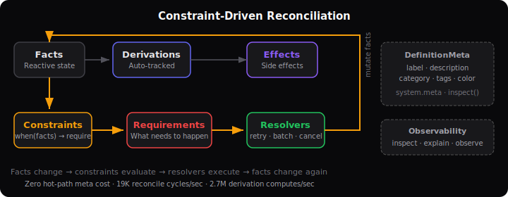

# Directive

**The constraint-driven runtime for TypeScript.** Declare what must be true. The runtime makes it happen.

[](https://www.npmjs.com/package/@directive-run/core)
[](#)
[](#)
[](./LICENSE)

- **Constraint-Driven Resolution** &ndash; declare requirements, resolvers fulfill them automatically with retry, batching, and error boundaries
- **AI Guardrails** &ndash; prompt injection detection, PII redaction, cost tracking, multi-agent orchestration with 4 LLM adapters (zero SDK dependencies)
- **Auto-Tracking Derivations** &ndash; computed values that track their own dependencies, no manual dep arrays
- **5 Framework Adapters** &ndash; React, Vue, Svelte, Solid, Lit from a single state layer
- **Zero Runtime Dependencies** &ndash; nothing to audit, nothing to break
- **Time-Travel Debugging** &ndash; snapshot, rewind, replay, export/import system state

---

<p align="center">
  
</p>

---

## How It Works

Other state libraries react to what happened. Directive enforces what must be true.

```typescript
// Traditional: describe HOW to change state
dispatch({ type: 'FETCH_USER', id: 123 });
// then write a thunk, saga, or effect to handle it...

// Directive: declare WHAT must be true
constraints: {
  needsUser: {
    when: (facts) => facts.userId > 0 && !facts.user,
    require: { type: "FETCH_USER" },
  },
}
// The runtime handles when, how, retry, and error recovery.
```

Set `userId = 123` and the constraint fires, the resolver fetches the user, and the system settles &mdash; automatically.

---

## Quick Start

```bash
npm install @directive-run/core
```

```typescript
import { createModule, createSystem, t, type ModuleSchema } from '@directive-run/core';

const userModule = createModule("user", {
  schema: {
    facts: {
      userId: t.number(),
      user: t.object<{ id: number; name: string } | null>(),
    },
    derivations: { isLoggedIn: t.boolean() },
    events: {},
    requirements: { FETCH_USER: {} },
  } satisfies ModuleSchema,

  init: (facts) => {
    facts.userId = 0;
    facts.user = null;
  },

  constraints: {
    needsUser: {
      when: (facts) => facts.userId > 0 && facts.user === null,
      require: { type: "FETCH_USER" },
    },
  },

  resolvers: {
    fetchUser: {
      requirement: "FETCH_USER",
      resolve: async (req, context) => {
        const res = await fetch(`/api/users/${context.facts.userId}`);
        context.facts.user = await res.json();
      },
    },
  },

  derive: {
    isLoggedIn: (facts) => facts.user !== null,
  },
});

const system = createSystem({ module: userModule });
system.start();

system.facts.userId = 123;       // Constraint fires automatically
await system.settle();            // Wait for resolution
console.log(system.facts.user);   // { id: 123, name: "John" }
```

---

## AI Guardrails and Orchestration

The same constraint-driven model powers AI agent safety. Guardrails are constraints. Agent runs are resolvers. The runtime enforces them automatically.

```bash
npm install @directive-run/ai
```

```typescript
import { createAgentOrchestrator } from '@directive-run/ai';
import { createAnthropicAdapter } from '@directive-run/ai/anthropic';

const orchestrator = createAgentOrchestrator({
  agent: {
    name: "assistant",
    model: createAnthropicAdapter({ model: "claude-sonnet-4-5-20250514" }),
    systemPrompt: "You are a helpful assistant.",
  },
  guardrails: {
    input: [promptInjectionGuardrail(), piiGuardrail()],
    output: [contentModerationGuardrail()],
  },
  budget: { maxTotalCost: 1.00 },
});
```

- **4 LLM adapters** &ndash; OpenAI, Anthropic, Ollama, Gemini (pure `fetch`, zero SDK deps)
- **Built-in guardrails** &ndash; PII redaction, prompt injection, content moderation, rate limiting
- **Multi-agent patterns** &ndash; parallel, sequential, supervisor, debate, DAG, goal-driven
- **Cost tracking + budget enforcement** &ndash; per-agent and per-system limits
- **Streaming with backpressure** &ndash; real-time token streaming with inline constraint evaluation

[AI Documentation &rarr;](https://directive.run/ai/overview)

---

## React Integration

```bash
npm install @directive-run/react
```

```tsx
import { useFact, useDerived } from '@directive-run/react';

function UserProfile({ system }) {
  const user = useFact(system, "user");
  const isLoggedIn = useDerived(system, "isLoggedIn");

  if (!isLoggedIn) return <p>Please log in</p>;
  return <p>Hello, {user?.name}!</p>;
}
```

## Framework Support

| Framework | Package | Style |
|-----------|---------|-------|
| **React** | `@directive-run/react` | Hooks with `useSyncExternalStore` |
| **Vue** | `@directive-run/vue` | Composables with reactive refs |
| **Svelte** | `@directive-run/svelte` | Stores with `$` syntax |
| **Solid** | `@directive-run/solid` | Signals with fine-grained reactivity |
| **Lit** | `@directive-run/lit` | Reactive Controllers for Web Components |

---

## Why Directive?

| | Redux | Zustand | XState | Directive |
|---|---|---|---|---|
| Constraint-driven resolution | | | | Yes |
| Auto-tracking derivations | | | | Yes |
| AI guardrails + orchestration | | | | Yes |
| Retry, batching, error boundaries | Manual | Manual | Manual | Built-in |
| Time-travel debugging | Extension | | Partial | Built-in |
| Framework-agnostic (6 adapters) | React only | React only | Any | Any |
| Zero runtime dependencies | | Yes | | Yes |
| `explain()` &ndash; why does this state exist? | | | | Yes |

---

## Packages

| Package | Description |
|---------|-------------|
| [`@directive-run/core`](./packages/core) | Core runtime &ndash; modules, systems, plugins, testing |
| [`@directive-run/react`](./packages/react) | React hooks (useFact, useDerived, useSelector, etc.) |
| [`@directive-run/vue`](./packages/vue) | Vue composables with reactive refs |
| [`@directive-run/svelte`](./packages/svelte) | Svelte stores with `$` syntax |
| [`@directive-run/solid`](./packages/solid) | Solid signals with fine-grained reactivity |
| [`@directive-run/lit`](./packages/lit) | Lit reactive controllers |
| [`@directive-run/ai`](./packages/ai) | AI orchestration, guardrails, multi-agent |
| [`@directive-run/cli`](./packages/cli) | CLI &ndash; scaffolding, inspection, AI coding rules |

## Documentation

- [Getting Started](https://directive.run/docs/quick-start)
- [Core Concepts](https://directive.run/docs/core-concepts)
- [AI Guardrails](https://directive.run/ai/overview)
- [API Reference](https://directive.run/docs/api)
- [Examples](https://github.com/directive-run/directive/tree/main/examples)
- [Pricing](https://directive.run/pricing)

## Contributing

See [CONTRIBUTING.md](./CONTRIBUTING.md) for development setup and architecture overview. A [CLA](./CLA.md) signature is required for all contributions.

## License

[MIT OR Apache-2.0](./LICENSE) &mdash; your choice.
